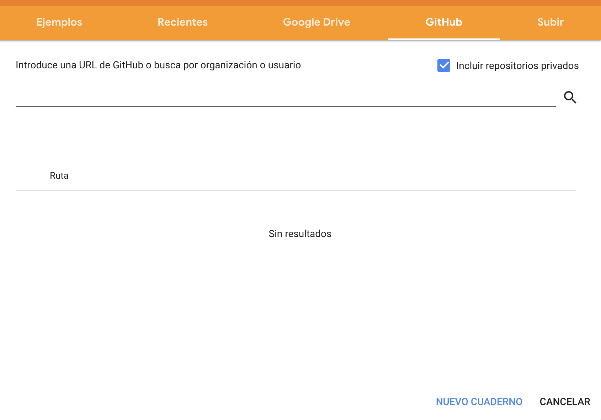
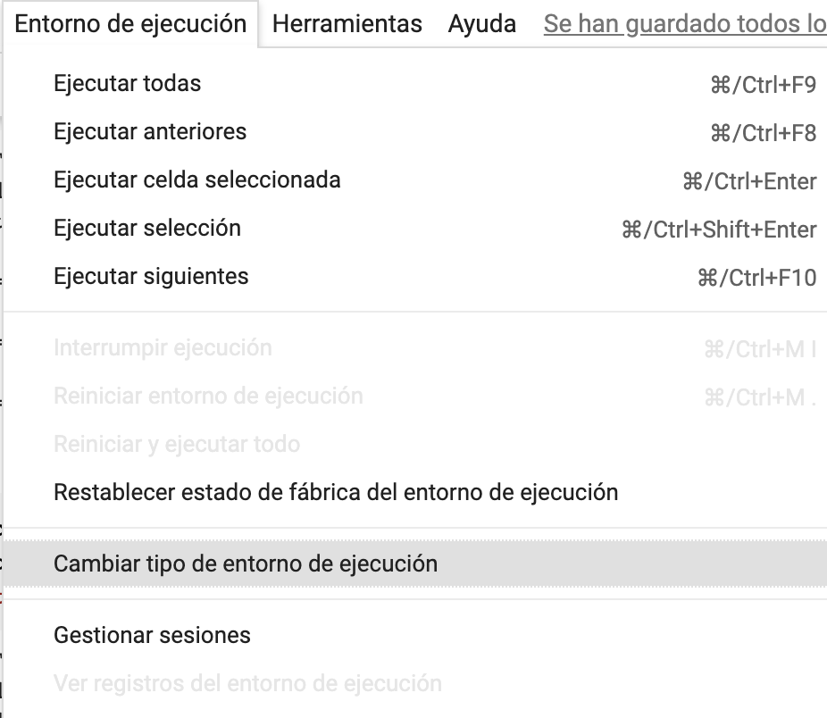
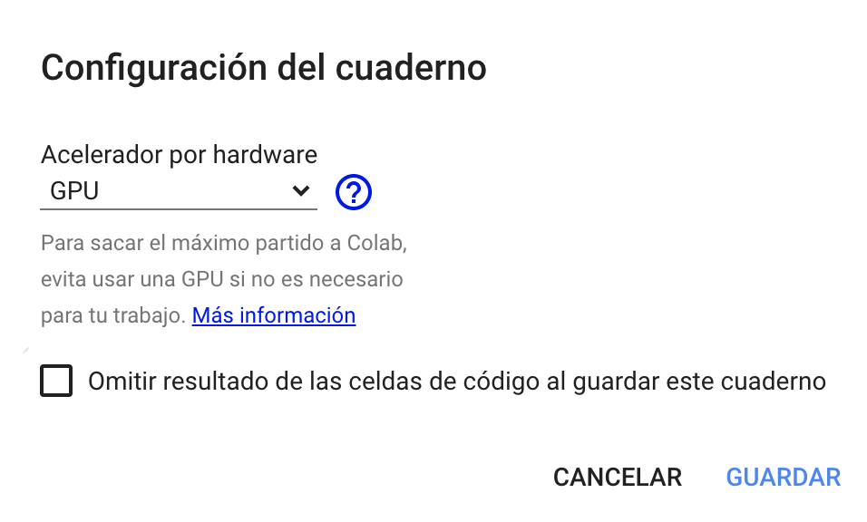

# Tutorial de ART

> Un tutorial de Adversarial Machine Learning con ART.

## ¿Qué es ART?

[Adversarial Robustness Toolbox](https://adversarial-robustness-toolbox.readthedocs.io/en/latest/) abreviado como ART, es una librería opensource de [Adversarial Machine Learning](https://www.bbvanexttechnologies.com/adversarial-machine-learning) que permite comprobar la robustez de los modelos demachine learning. Está desarrollada en Python e implementa ataques y defensas de extracción, inversión, envenenamiento y evasión. ART soporta los frameworks más populares: Tensorflow, Keras, PyTorch, MxNet, ScikitLearn, entre muchos otros). Además, no está limitada al uso de modelos que emplean imágenes como entrada, sino que soporta otros tipos de datos como audio, vídeo, datos tabulares, etc.

  

### Enlaces útiles

* [Documentación](https://adversarial-robustness-toolbox.readthedocs.io/en/latest)
* [Repositorio](https://github.com/Trusted-AI/adversarial-robustness-toolbox)
* [Notebooks de ejemplo](https://github.com/Trusted-AI/adversarial-robustness-toolbox/tree/main/notebooks)

## Visión general del tutorial

La carpeta `notebooks` contiene 4 notebooks que cubren ataques de evasion, envenenamiento, inversión y extracción.

* **Hola ART y evasión**: contiene la instalación de ART y sus dependencias así como ejemplos de evasión y defensas.
* **Inversión**: contiene un ataque de inversión.
* **Envenenamiento**: contiene cómo generar una puerta trasera en un modelo y cómo defenderse de ella.
* **Extracción**: contiene cómo aplicar defensas a modelos.

Todos los notebooks se pueden ejecutar más rápidamente empleando GPU, salvo el notebook de envenenamiento que requiere versiones específicas de Keras y Tensorflow que no permiten el uso de GPU en Colab.

El orden en el que se ejecuten los notebooks es irrelevante, pero es recomendable comenzar por `Hola ART y evasión` para familiarizarse con la librería.

## Cómo importar los notebooks en Colab

> NOTA: Para realizar el tutorial, es altamente conveniente disponer de una cuenta de Google para emplear el servicio Colab y emplear GPUs de forma gratuita.

  1. Entrar en [Google Colab](https://colab.research.google.com/).

  2. Importar todos los notebooks de este repositorio usando pestaña GitHub.

  

    
  

  3. Cambiar el entorno de ejecución a `GPU`, salvo en el notebook de envenenamiento.

  Se encuentra en el menú `Entorno de ejecución > Cambiar entorno de ejecución`.

  

    
  

  

    
  

## Crédito

Los ataques de envenenamiento e inversión se basan en los ejemplos proporcionados por ART en su repositorio.
